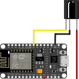

# atv2kodi

a small utility i hacked together one evening because my old apple tv couldn’t run netflix anymore. i had a raspberry pi with kodi, always liked the feel of the apple tv remote, so i wanted to reuse it. an esp8266 with an ir receiver was lying around, so i made it translate the apple tv ir signals into kodi json-rpc over wifi.  
of course apple had to slightly mess with the nec protocol, so i had to decode it manually instead of just using a library.

## hardware
- esp8266 board (nodemcu, wemos d1 mini, etc.)  
- demodulating ir receiver, output wired to gpio14 (d5)  

## build

### platformio
```bash
pipx install platformio
git clone https://github.com/objz/atv2kodi.git
cd atv2kodi
pio run -t upload
pio device monitor
```

### arduino ide

* install esp8266 board support via boards manager
* install arduinojson (v6)
* open `src/main.cpp` and upload

## config

edit these in `main.cpp` before building:

```cpp
const char* WIFI_SSID = "your-wifi";
const char* WIFI_PASS = "your-pass";
const char* KODI_HOST = "192.168.x.x";
const int   KODI_PORT = 8080;
```

after uploading press RST to restart the device.
make sure kodi has “allow remote control via http” enabled.

## status

works fine with apple tv 2 remote. tested on kodi 20.x and esp8266 nodemcu.

## wiring

ir receiver → esp8266:

| ir pin | esp8266 pin |
| ------ | ----------- |
| vcc    | 3v3         |
| gnd    | gnd         |
| out    | d5 (gpio14) |

diagram:




## other boards

should also work on esp32 or similar, but you’ll have to change the gpio number in `main.cpp` and pick the right board in platformio/arduino ide. timings might need tweaking too. basically: doable, but you’re on your own.
